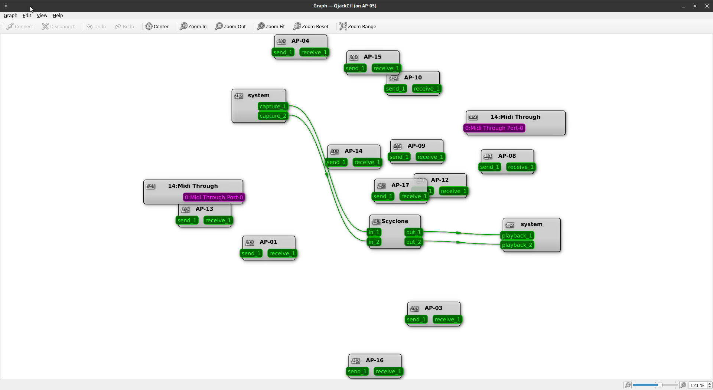
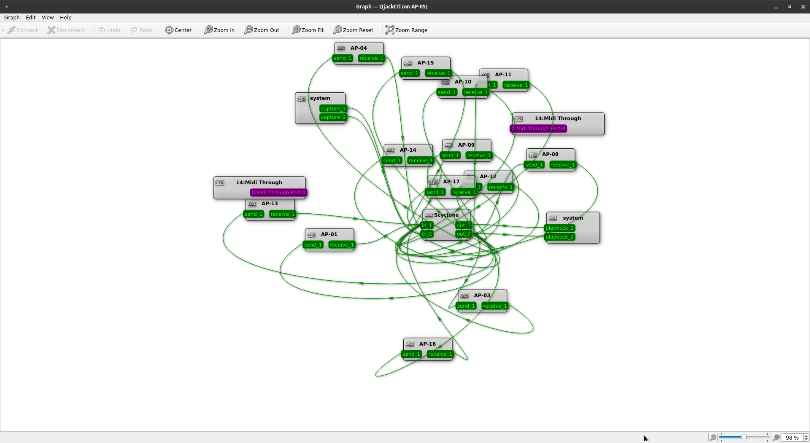
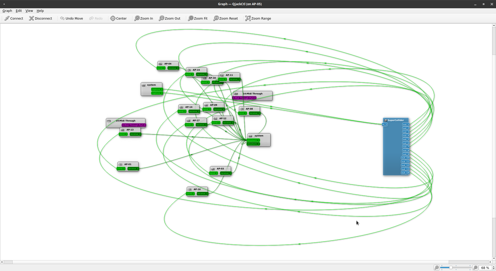

# Jack & JackTrip

## Jack

[Jack](https://jackaudio.org/) is a sound server API, which connects different audio applications. Each Rasperry PI runs a Jack server.

## JackTrip

[JackTrip](https://jacktrip.github.io/jacktrip/) is a network audio protocol. It connects the Jack servers of all Rasperry PIs via ethernet.

This image shows all Jack clients on a single Rasperry PI with an additional processing tool (scyclone). To this point, only scyclone is connected:

  { width="90%" }

  

## Ring Topology

The ring topology connects each access point with two other access points,
thus creating a closed loop.
A signal can then travel around all PIs. For the scyclone piece, the connections look like this:

  { width="90%" }

  
 WORK/2023_Music_Interaction_Systems/Public_Docs/docs/graphics/.png

## Fully Connected Mesh

In a fully connected mesh, every access point is connected to all other access points.
The camera tracking project uses this connection graph:

 { width="90%" }

  
