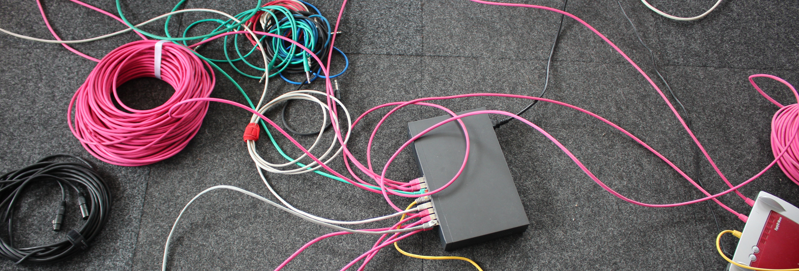

# Music Interaction Systems

!!! info "Demo/Performance/Tryout @ [LNDW](https://www.langenachtderwissenschaften.de/en/program/detail/50694)"

    <!-- | Saturday, June 17 |  |    TU Main Building                      |
    | -----------       |  |------------------------------------ |
    | 18:00 - 24:00     |  | Audimaxfoyer EG und 1. OG  |
    |                   |  | Straße des 17. Juni 135 |
    |                   |  | 10623 Berlin | -->

**18:00 - 24:00**

    { width="90%" }

A TU Studio Project (Audio Communication Group).

At [TU Studio](https://www.tu.berlin/en/ak/institutions-and-services/tu-studio/tu-studio-history), students, scientists and musicians are exploring the possibilities of so called meta-instruments. Intelligent networks are used to connect arbitrary musical instruments, giving rise to novel possibilities in composition and performance.
At LNDW, Students will present compositions and improvisations from class in an open environment. The audience is invited to move freely, listen, ask questions and interact with the system [[More Info](https://www.langenachtderwissenschaften.de/en/program/detail/50694)].

---

- Find these pages: [nsmi.ringbuffer.org](http://nsmi.ringbuffer.org)
