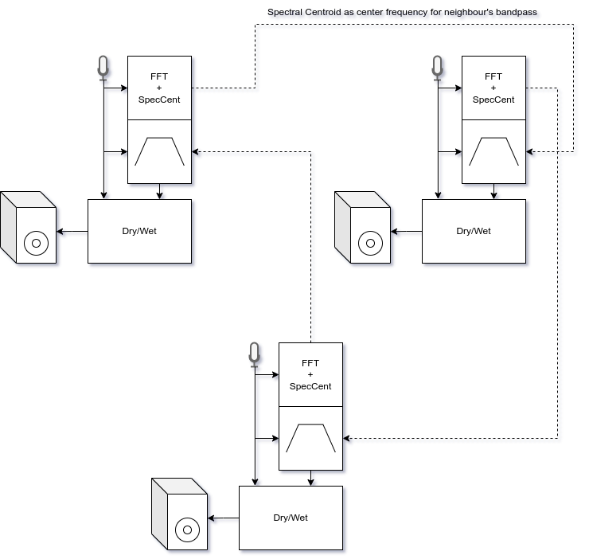

# Neighbour's Spectral Phaser

Concept and programming:  Jakob Tschavoll

---

Circular network topology shown with 3 stations (1 station means 1 mic/instrument, 1 loudspeaker, 1 pi):

{ width="80%" }

  

Each participant's original audio generates continuous spectral centroids which are sent to the next participant via OSC messages. These values act as center frequencies for a notch gain filter running on each pi. This means, that one participant's fluctuating spectral content generates a fluctuating phaser effect ontheir neighbour's audio. This effect should have a dry/wet control to preserve the original sound but also the "neighbour-generated" filter settings.
