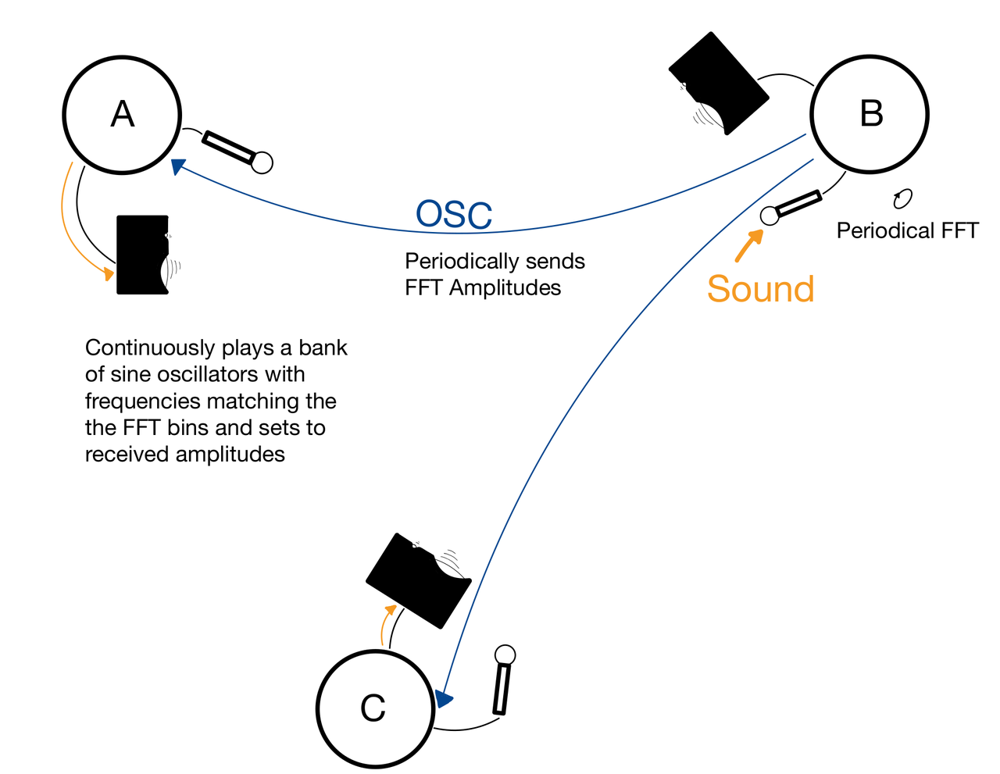

-----

## p2psc

*Peer 2 Peer Sound Control*[^p2psc] is a software system for network music by Ben Wieder (TU/Neumann). It consists of the following components:

- Python Network Layer
- SuperCollider classes
- ansible-based deployment and configuration

[^p2psc]: [https://github.com/bontric/p2psc](https://github.com/bontric/p2psc)

 

----

### Network-Feedback Installation

A use case for an interactive sound installation:

- wireless connection for wide range
- artistic exploration of network feedback

| | |
| :-: | :-: |
|{style="width:99%"} |{style="width:99%"} |
|*Feedback network flow 1.*|*Feedback network flow 2.*|

 Installation at ACUD, 2022: 

 <video width="60%" controls>  <source src="/videos/feedback_acud.mp4" type="video/webm"></video>

 

----

### Reenacting Classics

p2psc is a tool for reenacting concepts from the early days of network music - without a lot of setup and configuration:

{style="width:22%"}
 
*The Hub: Pioneers of Network Music (2022, L. Bruemmer [Ed.] )*

 

Playing 'Waxlips' (The HUB, 1991):

 <video width="49%" controls>  <source src="/videos/ben2.mp4" type="video/webm"></video> <video width="49%" controls>  <source src="/videos/ben1.mp4" type="video/webm"></video>

 
