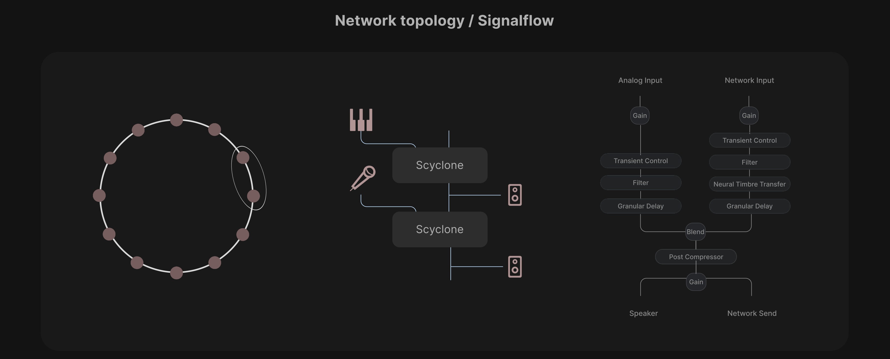
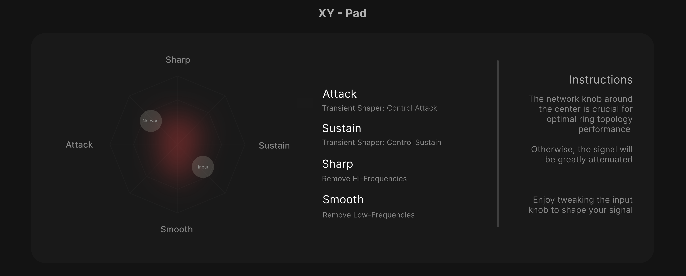
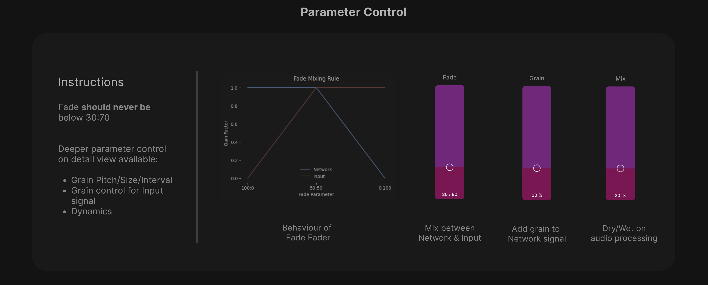
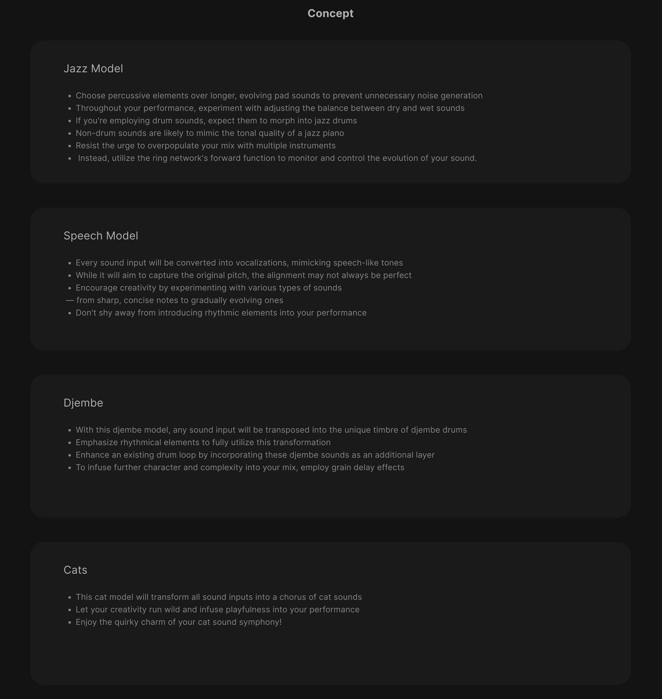

# SCYCLONE

Concept and programming: Valentin Ackva

## Network Topology

{ width="90%" }

  

## XY-PAD

{ width="90%" }

  

## Parameter Control

{ width="90%" }

  

## Performance Concept

{ width="90%" }

  
