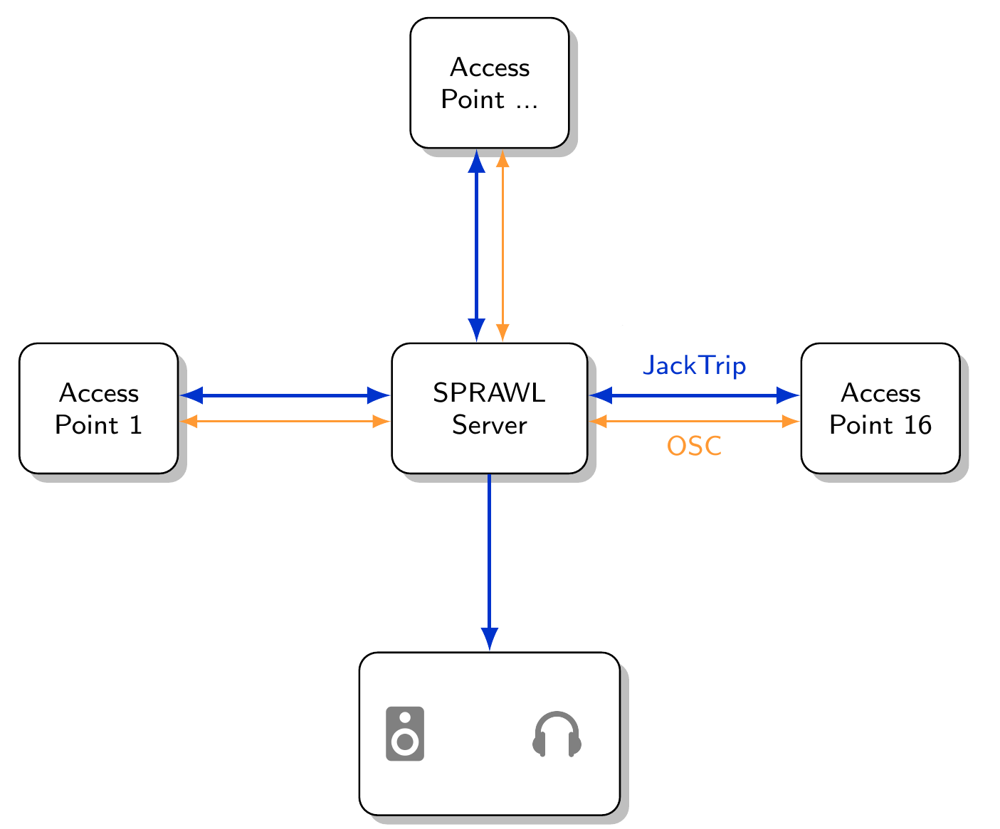
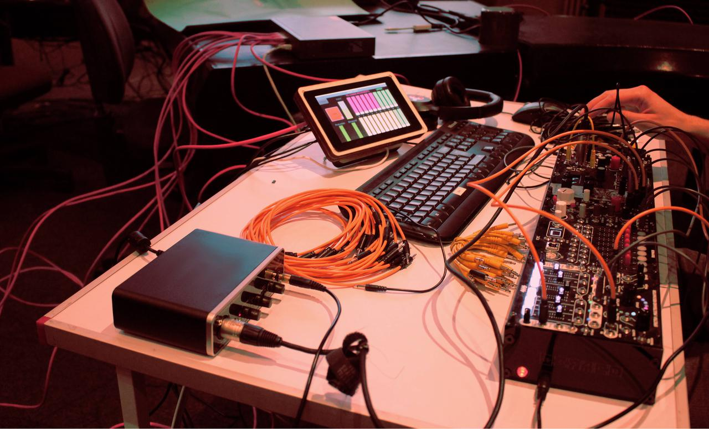
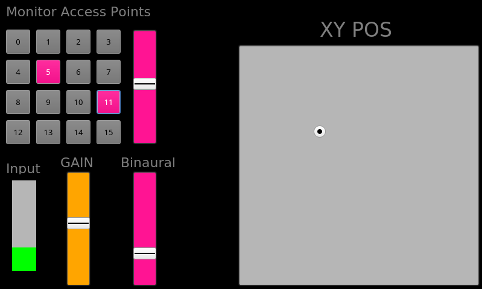
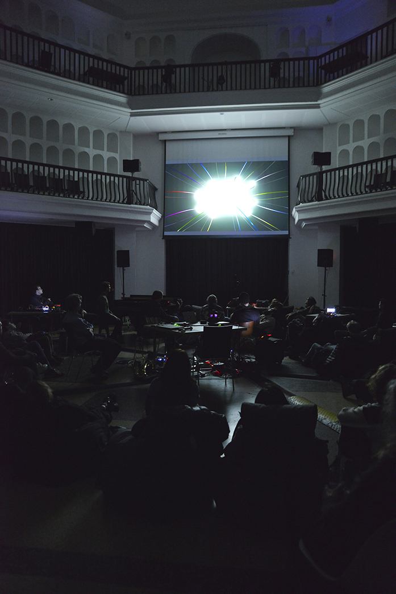
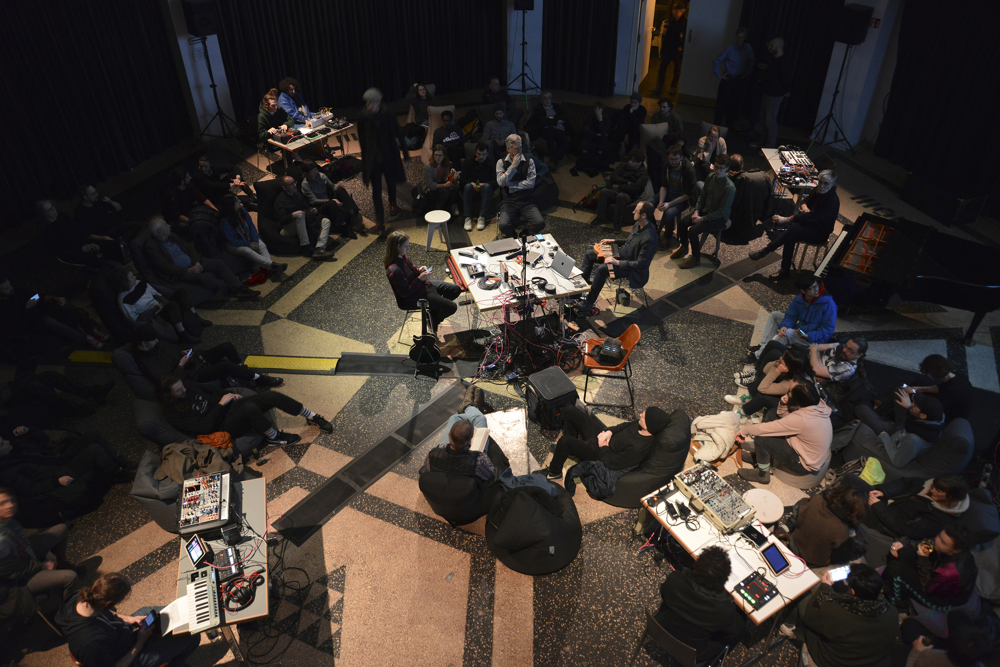
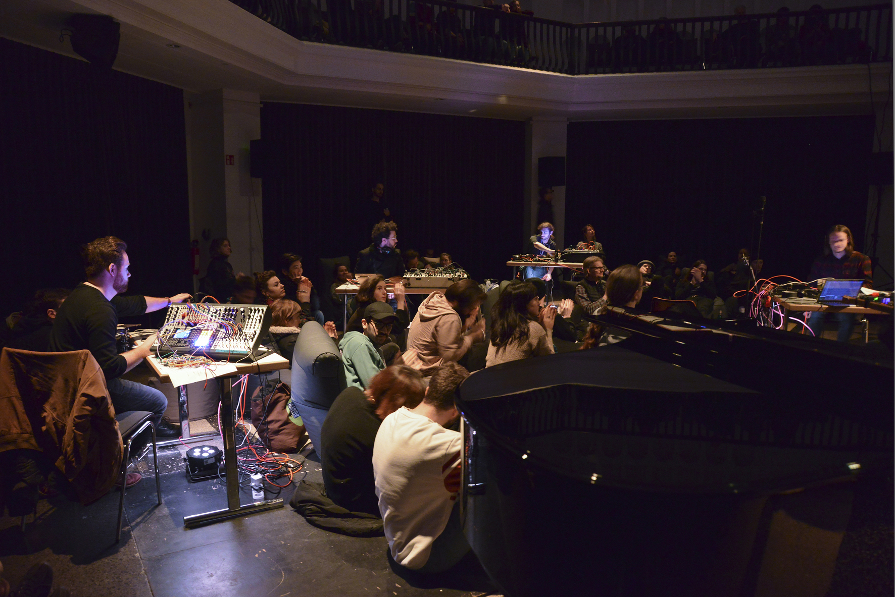

# SPRAWL 2020

-----

### Basic Concept

A local audio/metadata network system (von Coler et al., 2020)[@voncoler2020sprawl]:

- Any instrument can be connected to *Access Points*:
    - Raspberry PI + audio interface
- HUB server for mixing and spatial rendering:
    - OSC for control
    - JackTrip for audio
- Free & open source[^sprawl]
    - SuperCollider, PD, Faust
- **Any musician has access to system parameters.**

[^sprawl]: [https://github.com/anwaldt/SPRAWL](https://github.com/anwaldt/SPRAWL)

| |
| :-: |
|{style="width:77%"} |  
|*The SPRAWL topology with server and access points.*|

 

----

### Designing and Testing

Designed and built in a class with TU and CCRMA:

| | |
| :-: | :-: |
|{style="width:100%"} | {style="width:100%"}|
| *Building the system in class.* | *First tests in the TU studio.*|

Typical setup with modular synth:

| | |
| :- | :-: |
|{style="width:68%"} | {style="width:100%"}|
| *Access Point with modular.* | *Default remote screen.*|

 

-----

### SPRAWL in Concert

Concert with the EOC, TU students and various guests:

- 3D sound system on 3 levels
- audience can move freely

| |
| :-: |
|{style="width:33%"} |  
|*Concert with SPRAWL at Silent Green (2020).*|

| | |
| :-: | :-: |
|{style="width:88%"} | {style="width:88%"}|
| *View from the top.* | *Students performing with SPRAWL.*|
